# CloudFreeAI: AI-Powered Multi-Temporal Satellite Reconstruction & Disaster Intelligence

CloudFreeAI is a research-grade remote sensing and disaster intelligence platform designed for the **Bharatiya Antariksh Hackathon (BAH) 2026**. It reconstructs cloud-covered, high-resolution optical satellite imagery (Resourcesat-2/2A LISS-IV) by constraining reconstructions with current Sentinel-1 Synthetic Aperture Radar (SAR) observations and historical cloud-free baselines, preserving physical and scientific accuracy.

---

## 🛰️ Operational System Architecture

```mermaid
graph TD
    User([User GIS Client]) -->|1. Request Area of Interest| API[FastAPI Gateway]
    API -->|2. Delegate to Task Broker| Orch[Central Workflow Orchestrator]
    
    subgraph MLOps [MLOps & Model Registry Layer]
        MR[Model Registry DB] -->|Model Checkpoints| Version[Model Versioning v2.4.1]
        Version -->|Deploy Weights| Service[Inference Service Engine]
        Service -->|Real-time Performance| Monitor[Performance Monitoring & Logging]
        Monitor -->|Telemetric State| Orch
    end

    %% Ingestion & Discovery
    Orch -->|3. Query Metadata| Disc[Dataset Discovery Engine]
    
    subgraph Discovery [Data Discovery & Ingestion]
        Disc -->|Metadata Search| MetaQuery[Bhoonidhi Catalog Search]
        MetaQuery -->|Filter Cloud Cover| CloudFilt[Cloud Coverage Filter]
        CloudFilt -->|Acquisition Season / Solar angle| TempRank[Temporal Rank Engine]
        TempRank -->|Reference Selection| RefSel[Reference Scene Selection]
        RefSel -->|Enqueue Download| DL[Download Manager]
    end

    %% Spatial DB Caching
    DL -->|Raw Orbit & Raster files| Cache[Spatial DB Raster Cache]
    Cache -->|Validate Bounds| MetaVal[Metadata Validation: Bands & Projections]

    %% Data Quality Filter / Image Quality Assessment
    MetaVal -->|Radiometric DN check| IQA[Image Quality Assessment: cloud %, missing bands, striping, sensor errors]
    IQA -->|Filter evaluation| AcceptReject{Accept / Reject Scene}
    
    subgraph Preprocessing [Scientific Preprocessing Module]
        AcceptReject -->|If Accepted - SAR VV/VH| S1_1[SAR Orbit Correction]
        S1_1 --> S1_2[SAR Thermal Noise Removal]
        S1_2 --> S1_3[SAR Radiometric Calibration]
        S1_3 --> S1_4[SAR Range-Doppler Terrain Correction]
        S1_4 --> S1_5[SAR Speckle Filtering: Refined Lee]
        S1_5 --> S1_6[SAR Amplitude Normalization]
        
        AcceptReject -->|If Accepted - Optical| Opt_1[TOA Reflectance Calibration]
        Opt_1 --> Opt_2[Atmospheric Correction: Dark Object Subtraction]
        Opt_2 --> Opt_3[Band Normalization]
        Opt_3 --> Opt_4[Histogram Matching]
        Opt_4 --> Opt_5[Seasonal Normalization]
    end
    
    subgraph AI [Physics-Guided Multi-Modal SAR-Optical Fusion Engine]
        Opt_5 -->|Historical Baseline| OptEnc[Historical Optical Encoder]
        S1_6 -->|Current SAR Guidance Constraints| SAREnc[Current SAR Encoder]
        
        OptEnc & SAREnc --> TempFuse[Spatial-Temporal Fusion Transformer]
        TempFuse --> CrossAttn[Cross-Attention Interpolation]
        CrossAttn --> DiffNet[Conditional Diffusion Reconstruction Model]
        DiffNet --> SpecCons[Spectral Consistency & Quality QC]
    end

    subgraph Explain [Explainable AI Layer]
        SpecCons --> AttnM[Attention Weights Synthesis]
        SpecCons --> UncertM[Pixel Uncertainty Estimation]
        SpecCons --> FeatImp[Feature Importance & Pixel Attribution]
    end

    subgraph QA [Quality Assurance Validation Split]
        AttnM & UncertM & FeatImp --> ReconstructionQA[I. Image Quality: PSNR, SSIM, RMSE]
        AttnM & UncertM & FeatImp --> SpectralQA[II. Spectral Integrity: SAM, NDVI Delta]
        AttnM & UncertM & FeatImp --> GeometricQA[III. Geometric Consistency: IoU Score, Boundary Accuracy]
    end

    subgraph Disaster [Disaster Emergency Decision Support Engine]
        ReconstructionQA & SpectralQA & GeometricQA --> FloodSeg[DeepLabV3+ Flood Segmentation]
        ReconstructionQA & SpectralQA & GeometricQA --> ChangeDet[Siamese ViT Change Detection]
        
        FloodSeg & ChangeDet --> DamEval[Road Accessibility & Bridge Connectivity Evaluator]
        DamEval --> WaterDepth[Estimated Flood Depth: Model-Based]
        WaterDepth --> Population[Population Exposure & Hospital Accessibility Indexing]
        Population --> RescueIndex[Emergency Priority Index]
    end

    subgraph OutputArray [Full Output Data Array]
        RescueIndex -->|GeoTIFF Rasters| GeoTiff[GeoTIFF Band Map]
        RescueIndex -->|Vector Bounds| GeoJson[Flood GeoJSON]
        RescueIndex -->|XAI Heatmaps| XaiMap[Explainability Maps]
    end

    subgraph Reporting [Explanation & Output Layer]
        GeoTiff & GeoJson & XaiMap --> Gemini[Gemini 1.5 Pro Report Generator]
        Gemini -->|PDF report| PDF[Official Emergency PDF]
        Gemini -->|PowerPoint| PPTX[Brief PowerPoint Briefing]
        Gemini -->|Executive Summary| Summary[Interactive Executive Chat]
    end

    Summary --> User
```



---

## 🛠️ Detailed Preprocessing Chains

### 1. SAR Preprocessing
- **Orbit Correction**: Updates metadata coordinates using precise Sentinel Orbit State Vectors.
- **Thermal Noise Removal**: Strips noise contamination in sub-swaths.
- **Radiometric Calibration**: Converts pixel digital numbers to physical sigma-nought values.
- **Terrain Correction**: Resolves geometric distortions (layover, shadow) using SRTM 30m DEM arrays.
- **Speckle Filtering**: Dampens radar speckle backscatter noise using a 5x5 Refined Lee filter.
- **Normalization**: Scales backscatter bands to standardized training ranges.

### 2. Optical Preprocessing
- **TOA Calibration**: Standardizes sensor input variables based on solar distance and acquisition date.
- **Atmospheric Correction**: Dark Object Subtraction (DOS) offsets haze.
- **Band Normalization**: Standardizes multi-spectral channels (R, G, B, NIR).
- **Histogram Matching**: Radiometric conversion of historical baselines using the target scene histogram.
- **Seasonal Normalization**: Corrects phenological variations across seasonal offsets.

---

## 🛰️ Physical Remote Sensing Constraint Note
In this architecture, **Sentinel-1 SAR backscatter observations are utilized as physical constraints** to guide and bound the conditional diffusion model. Because SAR and optical sensors capture fundamentally different physical phenomena (microwave surface roughness/moisture vs solar reflectance), SAR data is NOT directly converted to optical bands. Instead, it constrains the spatial boundaries of features (e.g., water boundaries, landslides) during optical reconstruction.

---

## 🌟 Future Extension Modules (Roadmap)
```
Weather Forecast API --> Rainfall Prediction --> Future Flood Risk Estimation
```
*Note: Weather forecasting is labeled as a future extension module to maintain separation from the current satellite surface reconstruction engine.*

---

## 🧑‍💻 End User Dashboard Flow
```
User --> Dashboard --> AOI Selection --> AI Processing --> Results --> Layer Controls --> Compare Before/After --> Download GeoTIFF/GeoJSON --> Generate AI Report --> Interactive AI Chat
```
---

## 📂 Code Layout

- `/backend`: FastAPI geoprocessing service managing workflow orchestration, model registry, and database queries.
- `/frontend`: Next.js single-page client interface built with Tailwind CSS, Lucide Icons, and React.
- `/models`: PyTorch deep learning modules for image alignment, reconstruction, and flood segmentation.
- `/database`: PostGIS database schema definitions and spatial queries.
- `/scripts`: Python training and verification utilities.
- `/index.html`: Standalone, zero-setup GIS client for client-side local demonstrations.
