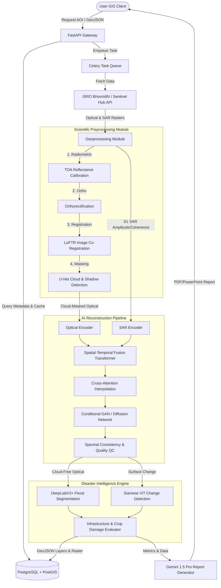

# CloudFreeAI: AI-Powered Multi-Temporal Satellite Reconstruction & Disaster Intelligence

CloudFreeAI is a research-grade remote sensing and disaster intelligence platform designed for the **Bharatiya Antariksh Hackathon (BAH) 2026**. It reconstructs cloud-covered, high-resolution optical satellite imagery (specifically Resourcesat-2/2A LISS-IV) by fusing historical cloud-free optical datasets with current Sentinel-1 Synthetic Aperture Radar (SAR) observations, outputting both reconstructed images and confidence estimates per pixel.

---

## 🛰️ System Architecture



---

## 📂 Core Project Layout

- `/backend`: FastAPI service managing GIS processes, DB connections, and Gemini report interfaces.
- `/frontend`: Next.js single-page client interface built with Tailwind CSS, Leaflet, and TypeScript.
- `/models`: PyTorch deep learning modules for image alignment, reconstruction, and flood segmentation.
- `/database`: PostGIS database schema definitions and spatial queries.
- `/scripts`: Python training and inference command line utilities.
- `/index.html`: Standalone, zero-setup GIS client for client-side local demonstrations.

---

## 🛠️ Tech Stack

- **GIS Frontend**: Next.js, TypeScript, Tailwind CSS, Leaflet.js, Framer Motion
- **ML & Geoprocessing**: PyTorch, Rasterio, GDAL, GeoPandas, OpenCV
- **Backend API**: FastAPI, Celery, Redis, PostgreSQL with PostGIS extension
- **GenAI Report Engine**: Gemini API
- **Deployment**: Docker, Docker Compose

---

## 🚀 Running the System (Docker Compose)

To spin up the database, Redis queue, background workers, backend API, and frontend server:

```bash
docker-compose up --build
```

The services will expose:
- Frontend Dashboard: `http://localhost:3000`
- Backend API Docs: `http://localhost:8000/docs`
- PostgreSQL Database: `localhost:5432`

---

## 🧑‍💻 Standalone Demonstration

If you are running in a restricted sandbox environment without docker or GPU runtime, open the root `index.html` file in any web browser. It features a complete telemetry simulated dashboard, real-time leaflet layers, opacity toggles, and side-by-side swipe comparison.
